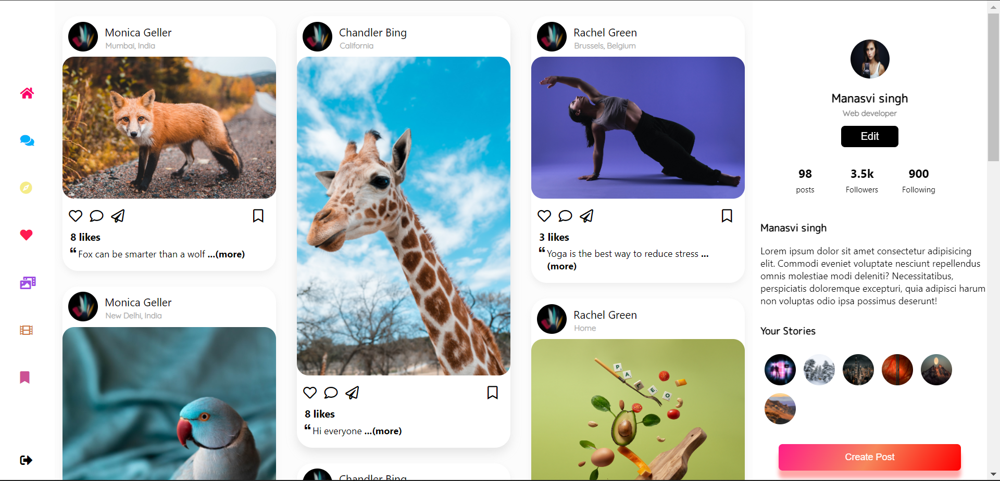
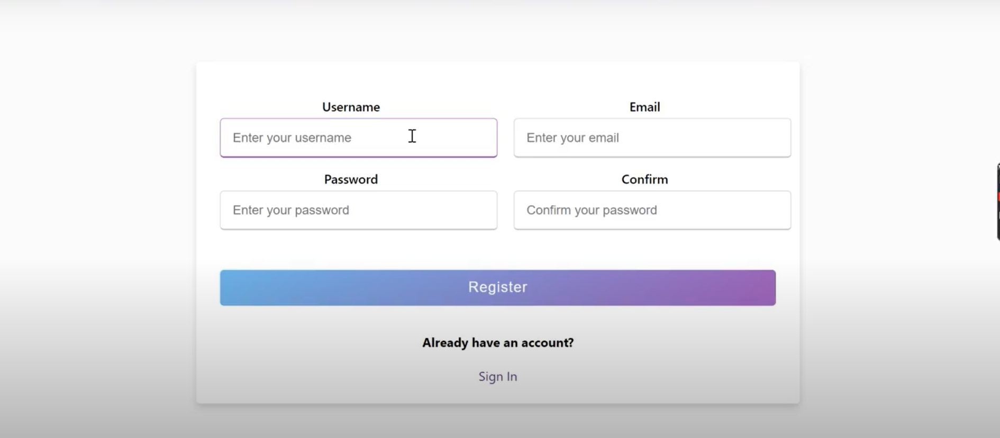
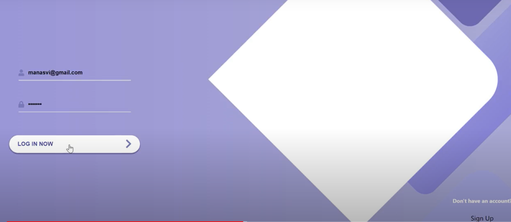
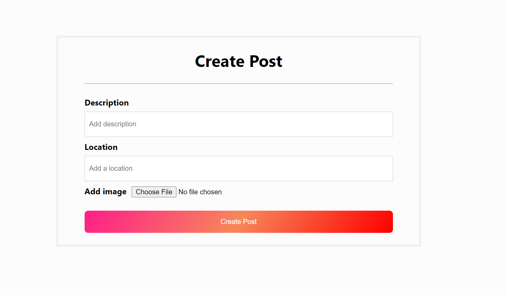

# Social media application in MERN

This is a primitive social media application which I wish to upgrade further. Currently it contains features like login/ sign up, create post and like post. It is made with React, Node, express and MongoDB.

## Screenshots of the project
### Home Page

### Sign up page

### Sign In page

### Create Post page


## Getting Started

These instructions will get you a copy of the project up and running on your local machine for development and testing purposes. First you need to make your own keys.js file in which you'll store your mongoDB atlas and Cloudinary keys. 

### Prerequisites
You need to have NodeJS and NPM installed. 
Then install the other dependencies

```
npm install express mongoose 
```
Also install whatever your terminal is telling you to install. 

### Installing

To start the app, first we need to run the server.

```
cd server
npm run serve
```

Then we need to start our react app.

```
cd frontend
npm start
```


